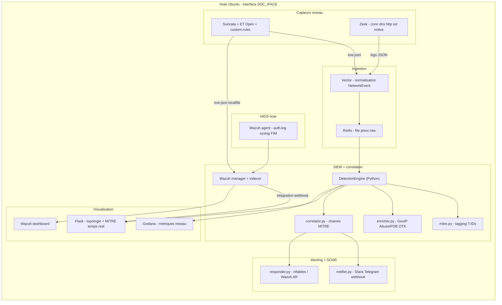

# Architecture du Mini-SOC

## Vue d'ensemble

Le Mini-SOC combine des outils standards de l'industrie (Suricata, Zeek, Wazuh)
pour la détection bas niveau, et un moteur Python pour ce qui fait la valeur du
projet : la **corrélation multi-source mappée MITRE ATT&CK**, l'**enrichissement
threat-intel** et la **réponse automatisée (SOAR)**.

## Flux de données

1. **Capture** : Suricata (signatures + ET Open) et Zeek (analyse protocolaire)
   écoutent `SOC_IFACE` en mode `network_mode: host`. Suricata écrit `eve.json`,
   Zeek écrit `conn.log`, `dns.log`, `http.log`, `notice.log`...
2. **Normalisation** : Vector lit ces fichiers, traduit chaque entrée vers le
   schéma commun `NetworkEvent` ([pipeline/schema.py](../pipeline/schema.py)) et
   pousse en JSON sur la file Redis `pisoc:raw`.
3. **Moteur Python** ([detection/engine.py](../detection/engine.py)) : consomme la
   file, puis pour chaque alerte :
   - tag MITRE ([detection/mitre.py](../detection/mitre.py)),
   - enrichissement IP ([detection/enricher.py](../detection/enricher.py)),
   - persistance SQLite + métriques InfluxDB,
   - corrélation ([detection/correlator.py](../detection/correlator.py)),
   - notification + réponse.
4. **SIEM Wazuh** : ingère `eve.json` (localfile) et les logs de l'agent hôte ;
   son active-response peut bloquer une IP (nftables) ; ses alertes de niveau
   élevé sont renvoyées au corrélateur Python via le webhook `/api/wazuh-event`.
5. **Visualisation** : Grafana (métriques), dashboard Wazuh (SIEM), dashboard
   Flask maison (topologie + incidents corrélés avec tags MITRE).

## Schéma pivot `NetworkEvent`

Tous les composants parlent le même langage : le `NetworkEvent`. C'est ce qui
permet de corréler des sources hétérogènes (Suricata, Zeek, Wazuh) sans couplage.
Champs clés : `event_type`, `src_ip/dst_ip`, `severity`, `tags`, `mitre`,
`enrichment`.

## Profils de déploiement (RAM)

| Profil | Services ajoutés | RAM indicative |
|---|---|---|
| core | redis, influxdb, grafana | ~0.5 Go |
| sensors | + suricata, zeek, vector | ~1 Go |
| siem | + wazuh manager/indexer/dashboard | ~3 Go |
| lab | + dvwa, juice-shop (réseau isolé) | ~0.5 Go |

Sur une machine 4 Go : profils `sensors` seul + `OPENSEARCH_JAVA_OPTS=-Xms512m -Xmx512m`
si l'on veut tout de même Wazuh.

## Décisions d'architecture

- **Vector remplace un consommateur Python dédié** : la normalisation se fait dans
  Vector (VRL), Vector écrit directement sur `pisoc:raw`. Une indirection en moins.
- **Détection déléguée** : plus de règles brute force / scan maison ; Suricata et
  Wazuh le font mieux. Le Python se concentre sur la corrélation et le SOAR.
- **nftables** (et non iptables) pour l'active-response, plus moderne et avec sets
  à timeout natifs.
